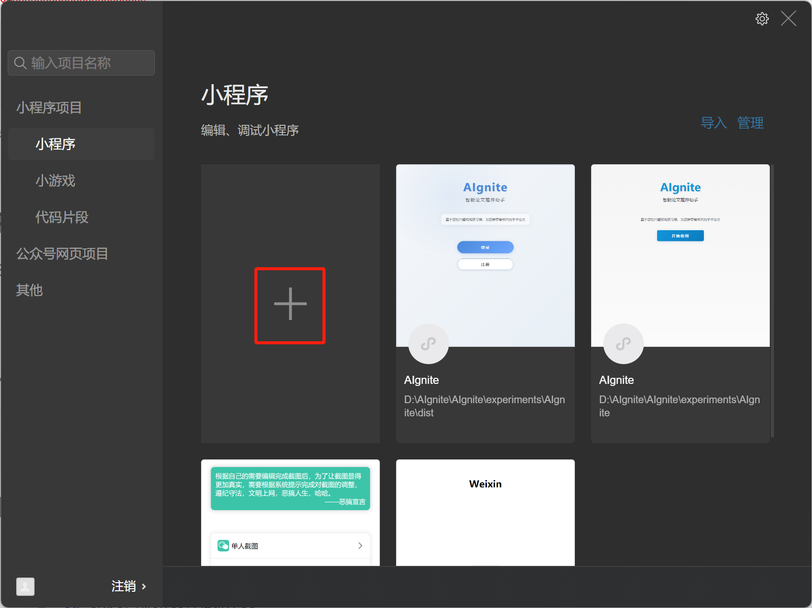
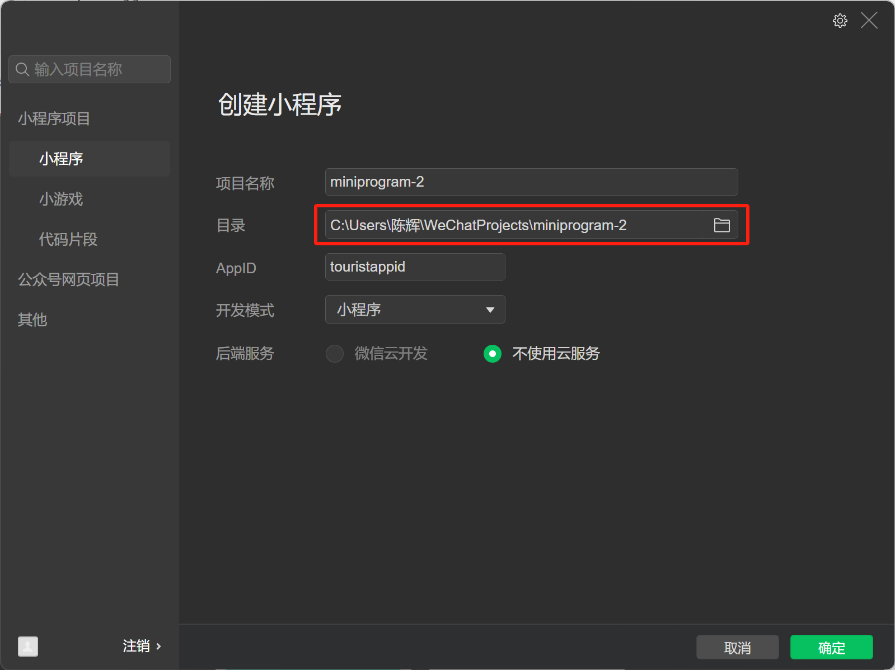

# Taro React Project Readme

This project is a Mini Program built with Taro React, designed to be extensible to H5 and other Mini Program platforms.

## Quick start

开始前确保你已经安装了`node.js`和`npm`
```
- Node.js:  v20.10.0+
- npm: 10.2.3+
```

```
# 在AIgnite目录下执行以下命令

cd experiments/AIgnite
## 安装依赖
pnpm install
## 运行
pnpm run dev:weapp
```

__打开微信开发者工具__



目录设置为`experiments/AIgnite`中构建的`dist`



## Prerequisites

Before you begin, ensure you have Node.js and npm (or yarn) installed on your system.

- **Node.js**:  v20.10.0+
- **npm**: 10.2.3+

You can verify your Node.js and npm versions by running:
```bash
node -v
npm -v
```

## Installation

1. Navigate to the project root directory (`experiments/AIgnite`) and install the dependencies:
   ```bash
   cd experiments/AIgnite
   # Using npm
   npm install
   ```

## Running the Project

Taro allows you to run the project in development mode for various platforms.

### WeChat Mini Program
```bash
# Using npm
npm run dev:weapp
```
This command will compile the project and output the build files to the `dist` directory. Open your WeChat Developer Tools, import the `dist` directory as the project, and you should see your Mini Program running.

### H5(暂时不建议，目前有一点冲突)

```bash
# Using npm
npm run dev:h5
```
This command will start a development server, and you can view the H5 application in your browser, usually at `http://localhost:10086`.

### Other Platforms
Taro supports other platforms like Alipay, Baidu, Toutiao, QQ Mini Programs, etc. You can run them using similar commands:
```bash
# Example for Alipay Mini Program
# npm run dev:alipay
# yarn dev:alipay
```
Refer to the `package.json` scripts for all available development commands.

## Building the Project

When you are ready to deploy your application, you can build it for production.

### WeChat Mini Program
```bash
# Using npm
npm run build:weapp
```

### H5
```bash
# Using npm
npm run build:h5
```

### Other Platforms
```bash
# Example for Alipay Mini Program
# npm run build:alipay
```
The production-ready files will be generated in the `dist` directory.

## Dependency Management

### Installing Dependencies
To add a new dependency:
```bash
# Using npm
npm install <package-name>
```

### Removing Dependencies
To remove an existing dependency:
```bash
# Using npm
npm uninstall <package-name>
```

## Project Structure

A typical Taro project has the following directory structure:
```
.
├── config/             # Build configuration files
│   ├── dev.js          # Development mode configuration
│   ├── index.js        # Default configuration
│   └── prod.js         # Production mode configuration
├── dist/               # Compiled files for different platforms
├── node_modules/       # Project dependencies
├── public/             # Static assets (will be copied to dist) (Taro 3.1+)
├── src/                # Source code
│   ├── app.config.js   # Global configuration
│   ├── app.js          # Entry file (or app.tsx for TypeScript)
│   ├── app.scss        # Global styles (or app.less, app.css)
│   ├── index.html      # H5 template
│   ├── pages/          # Page components
│   │   └── index/
│   │       ├── index.config.js # Page configuration
│   │       └── index.jsx     # Page component (or index.tsx)
│   ├── components/     # Reusable components
│   ├── utils/          # Utility functions
│   ├── assets/         # Static assets like images, fonts
│   └── services/       # API services, data fetching logic
├── .eslintrc.js        # ESLint configuration
├── .gitignore          # Git ignore file
├── babel.config.js     # Babel configuration
├── package.json        # Project metadata and dependencies
└── README.md           # This file
```

## Code Explanation (Based on your `src` directory)

The `src` directory is where most of your application's code resides. Here's a breakdown of the common files and folders found in your project:

*   `app.tsx`: This is the main entry point for your Taro application. It's where the global application class is defined, and you can set global states or lifecycle methods here.
*   `app.config.ts`: This file defines the global configuration for your application, such as pages, window appearance, tabBar (if not custom), network timeout settings, etc.
*   `app.scss`: Global styles for your application. Styles defined here will apply across all pages unless overridden by page-specific or component-specific styles.
*   `index.html`: This is the HTML template file used when compiling your project for H5 (web) deployment.
*   `pages/`: This directory contains all the page components of your application. Each subdirectory within `pages/` typically represents a single page and contains its logic (e.g., `index.tsx`), configuration (e.g., `index.config.ts`), and styles (e.g., `index.scss`).
*   `components/`: This directory is for reusable UI components that you create. These components can be imported and used across different pages and even within other components.
*   `assets/`: Store static assets like images, fonts, or other media files in this directory.
*   `store/`: This directory likely houses your state management solution (e.g., Redux, MobX, or Taro's built-in event center/observable pattern). It manages the application's data flow and shared state.
*   `custom-tab-bar/`: This directory contains the code for a custom tab bar, primarily used for WeChat Mini Programs to achieve a more customized look and feel than the default tab bar.
*   `custom-tab-bar.wxss`: This file contains the styles specifically for the custom tab bar. It's referenced by the WeChat Mini Program when a custom tab bar is enabled.

To understand the specifics of each page or component, you would navigate into the respective directories and examine their `.tsx` (or `.jsx`), `.config.ts`, and style files. 